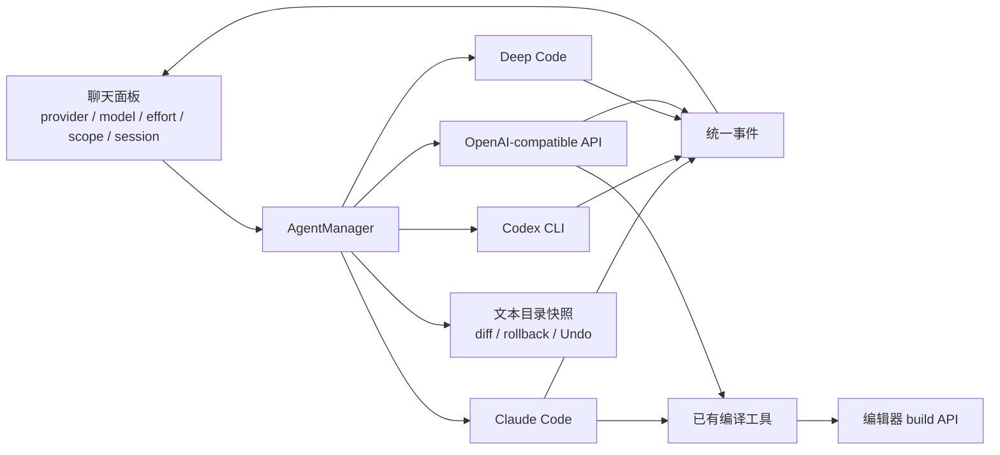

# AI 后端适配审计

审计日期：2026-10-08。审计提交：`9c2f0ef28b2d0827272e746b58c157be7c94441c`。

## 结论

需要继续适配。此前发布的修复解决了 Codex 被 Claude 文件工具指令阻塞的问题，但没有解决权限、编译、默认模型和附件契约的差异。

项目已经有清晰的 Backend 接口。应保留这个结构，逐项补齐真实能力。当前没有证据支持重写整个 Agent 框架、引入新 SDK，或为所有后端复制 Claude 的全部界面功能。

**最重要的新证据：本机 Codex CLI 0.156.1 支持原生按路径权限。** 离线原生 sandbox 测试允许写入 `main.tex`，同时拒绝写入 `other.tex` 和 `figure.png`。适配器仍使用宽泛的 `workspace-write`，并在注释中声称 Codex 没有按文件权限。这一判断已不适用于当前本机版本。生产 `exec`、恢复会话和 Windows/Linux 的效果仍需独立验证。

## 证据范围

| 证据 | 本次覆盖 | 限制 |
| --- | --- | --- |
| 源码审计 | 四个 Backend、AgentManager、服务端文件目录、前端引用/附件/命令 | 绑定上述提交 |
| 离线探针 | 默认模型、工具注册、路径、回滚、事件、前端函数 | 使用临时夹具、模拟 Backend/API；没有请求模型或外部仓库 |
| 原生 Codex sandbox | CLI 0.156.1；macOS；按路径限制写入 | 是原生 sandbox helper 测试；不是生产 `exec` 集成验收 |
| 本会话此前的真实 Codex 测试 | 新会话及旧会话恢复，读取文件并编辑 | 仅证明此前工具指令修复；不证明本报告提出的新适配已完成 |
| 全量现有测试 | `PRISM_SKIP_TEX=1`，215 项 | 5 failures、2 errors、14 skipped；真实 TeX 编译未验收 |
| 官方文档 | Codex 配置/MCP/Skills；Deep Code 架构/配置/权限 | 文档是动态版本；本机未安装 Deep Code |

未测试另一台 Windows/Linux 电脑。未连接真实 Ollama、DeepSeek 或 OpenAI-compatible 服务。未执行远端写入。本次仅新增本地审计文件，未修改产品代码，也未发布新改动。

## 当前结构与可以保留的设计



会话按 provider 分开，运行中的任务禁止切换 provider。API 写工具在写入前检查路径和 scope。Codex Ask 使用原生 read-only sandbox。Claude 已有按文件工具规则和编译 MCP。界面通过能力字段隐藏不支持的用量面板。这些都是可复用的实现。

需要修正的边界是：**共同任务规则不等于共同工具名称；文件快照不等于访问权限；界面支持某项功能不等于每个 Backend 都支持。**

| 当前适配器能力 | Claude Code | Codex CLI | Deep Code | API 后端 |
| --- | --- | --- | --- | --- |
| 文件工具指令 | 原生 Claude 工具 | 已改为 shell 读取 + apply_patch | 仍使用 Claude 工具名 | 显式注册自有工具 |
| Ask 写入限制 | 原生 plan 权限模式 | 原生 read-only sandbox | 适配器依赖回合后回滚 | 写工具不提供且函数拒绝写入 |
| 选中文件 scope | 文件工具许可规则 | 提示词 + 部分文件回滚 | 提示词 + 部分文件回滚 | 写工具前置检查 |
| 编译工具 | 已注册 MCP | 未注册 | 未注册 | Edit 已注册 |
| 配置 default_model | 未应用于命令 | 未应用于命令 | 未应用于环境 | 已应用 |
| 编辑器 Skills 目录 | 已接入 | 未接入 | 未接入 | 未接入 |
| 附件传输 | 项目文件路径 | 项目文件路径 | 项目文件路径 | 路径 + 文本消息，未构造视觉内容 |

表中描述适配器当前实现，不对底层运行时的所有权限配置作保证。`@file:lines` 的行范围目前是上下文和提示，不是所有后端都强制执行的写入边界。

## 必须优先处理的问题

### 1. API 搜索绕过项目路径检查 — P1，已复现

位置：`backend_openai.py:277–288,312–331`，`server.py:169–188`，`agent.py:59–66`。

`read_file` 使用 `_path()`，拒绝读取指向项目外的符号链接。`search` 直接读取 `(job.root / rel)`。服务端目录可以返回符号链接文件，快照也直接读取这些路径。

夹具将项目内 `linked.tex` 链接到临时项目外文件。直接读取被拒绝，搜索却返回了项目外标记。没有读取任何真实私人文件。

最小修复：搜索复用 `_path()`；目录和快照统一检查规范路径是否位于项目内。保留普通项目内符号链接的明确策略，不再形成两套路径规则。加入项目外、项目内和断链夹具。不要增加新依赖。

### 2. scope、Ask、diff 和 Undo 的保证范围不完整 — P1，离线模拟已复现

位置：`agent.py:59–66,150–181`，`server.py:169–188`，`backend_codex.py:1–16,51,67–82`，`backend_deepcode.py:121–122`。

AgentManager 只对编辑器目录中的文件做快照。图片、脚本、部分配置文件、隐藏目录和 build/排除目录不在快照内。Codex Edit 的 workspace-write 覆盖面比这个目录更大。Deep Code 适配器没有设置原生 Ask 只读策略。

模拟相同能力标志的 Backend 同时修改五个文件，结果如下：

| 模式 | 被回滚 | 被报告为 changed | 改动持续存在但未报告 |
| --- | --- | --- | --- |
| Edit，仅允许 main.tex | other.tex | main.tex | figure.png、script.py、build/x.tex |
| Ask，依赖事后回滚 | main.tex、other.tex | 无 | figure.png、script.py、build/x.tex |

这证明管理器的回滚和报告存在盲区。它不证明真实 Codex 会在原生 Ask sandbox 下写入文件，也不证明所有模型都会违反提示。

优先方案是使用运行时原生权限，限制写入发生。Codex 官方配置已提供 `permissions.<name>.filesystem.<path-or-glob>` 和命名权限 profile。本机原生测试已通过。采用新 profile 时必须避免与旧 `sandbox_mode` / `sandbox_workspace_write` 冲突，且须根据实际 CLI 版本验证能力。[Codex 配置参考](https://learn.chatgpt.com/docs/config-file/config-reference)

Deep Code 官方有权限分类机制。应先验证安装版本的 headless 模式是否能表达 Ask 和 scope，再决定回退方案。不能继续将“回合后恢复部分文本”描述成完整只读保证。[Deep Code 权限文档](https://github.com/lessweb/deepcode-cli/blob/main/docs/permission_en.md)

diff/Undo 仍需要独立定义覆盖哪些文件。即使原生权限修好了 scope，无 scope 的合法图片修改也不应被报告成没有修改。应将编辑器导航目录与变更覆盖范围区分；对无法恢复的文件明确显示限制。不要通过扩大快照来替代原生权限。

### 3. Deep Code 仍继承 Claude 工具假设 — P1/P2，源码和官方工具契约确认

位置：`backends.py:59–63`，`backend_deepcode.py:159–169`。

共享规则要求使用 `Read/Grep/Glob/Edit/Write`，并禁止 `cat/sed/python` 等 shell 读取。Deep Code 官方内置工具是 `bash/read/write/edit` 等，其编辑契约要求先读取并取得 snippet。当前指令仍直接复用 Claude 规则，并且只在新会话发送。恢复旧会话不会刷新规则。[Deep Code 架构文档](https://github.com/lessweb/deepcode-cli/blob/main/docs/architecture_en.md)

风险与此前 Codex 缺工具现象相似，但本机未安装 Deep Code，不能把它标记为真实运行复现。

最小修复：复用已有 FILE_TOOL_RULE 替换机制，给 Deep Code 使用原生工具的简短规则。每回合明确当前模式和规则。由 Deep Code 自身处理 snippet，不在编辑器复制它。验收必须包括真实新会话和旧会话恢复。

### 4. Codex 和 Deep Code 没有编辑器编译工具 — P2，命令构造已确认

位置：`backend_claude.py:360–365`，`backend_codex.py:67–82`，`backend_deepcode.py:171–176`，`backend_openai.py:129–131`。

Claude 注册现有 `mcp_compile.py`。API Edit 注册 compile。Codex 命令没有使用 `job.server_url` 注册工具，Deep Code 也未注册。共同指令又禁止直接运行 latexmk/pdflatex，所以两个 CLI 无法完成“修改后编译并修错”的完整流程。

最小修复：复用已有标准库 MCP 服务，按回合注入后端配置。Codex 已支持 stdio MCP。优先验证单次命令的 `-c mcp_servers...` 配置，不修改用户全局配置。Deep Code 按安装版本的原生 MCP 配置接入。[Codex MCP 文档](https://learn.chatgpt.com/docs/extend/mcp?surface=cli)

必须先统一 Ask 的编译语义：Claude 当前允许调用编译工具，API Ask 不提供。编译会写输出目录，因此“源文件只读但可编译”和“禁止任何写入”是不同契约。应让界面及权限策略使用同一个定义。

### 5. 三个 CLI 忽略配置中的默认模型 — P2，已复现

位置：`backends.py:178,216`，`agent.py:104–129`，`backend_claude.py:373–374`，`backend_codex.py:70–71`，`backend_deepcode.py:154–155`，`app.js:1753`。

当用户配置 provider 的 `default_model`，但没有在面板显式选模型时，界面显示这个默认模型。三个 CLI 只处理 `job.model`，未读取 `backend.default_model`。实际运行使用各自外部配置。API 正确使用二者的回退关系。

离线配置 `audit-default` 后，三个 CLI 均未传递它，API 传递了它。

最小修复：在管理器检查和创建 Job 之前统一计算有效模型，保持模型名验证，再将同一值用于检查、运行和显示。不要硬编码某个账号可用的模型。本会话此前真实 Codex 测试也遇到过外部默认模型与 CLI 账号不兼容；这不是所有安装都会发生的结论。

## 下一批适配问题

### 6. 附件上传成功不等于模型能够理解 — P2

位置：`app.js:1369–1373`，`backend_openai.py:127–128,301–305`。

所有后端收到的附件首先只是路径文本。API 请求没有构造 image 内容；其 `read_file` 将二进制按 UTF-8 替换解码。PNG 签名夹具产生了替换字符，不能据此得到视觉输入。

Codex 可能通过原生图片工具读取路径，不能仅因没有 `--image` 就断言其不支持图片。本次没有做真实视觉验收。Deep Code 的图片/PDF 能力也须以安装版本实测为准。

建议仅增加有实际用途的输入能力声明，例如 text/image/pdf。API 在模型支持时发送原生图像内容；不支持时在上传/发送前明确说明。保持文件名、类型及引用信息。不要默认给所有后端增加 PDF 解析、OCR 或新依赖。

### 7. Skills 提示错误，其他后端的斜杠消息会丢选区 — P2，已复现

位置：`app.js:1785,1838–1842`，`backends.py:209–218`。

界面说“只有 Claude Code 有 Skills”。实际上当前字段表达的是“编辑器是否接入 Skills 目录”，不是运行时是否拥有 Skills。Codex 和 Deep Code 都有原生 Skills。[Codex Skills 文档](https://learn.chatgpt.com/docs/build-skills)、[Deep Code 架构文档](https://github.com/lessweb/deepcode-cli/blob/main/docs/architecture_en.md)

`slashPrompt()` 只在命令属于 Claude Skills 目录时追加引用正文。其他 provider 的空目录导致 `/review @main.tex:1-2` 丢失编辑器选区正文。探针直接运行实际前端函数，已确认丢失。

先修正文案和引用保留，再考虑目录接入。未知斜杠消息作为普通文本处理时应保留引用，或明确拒绝。不要将 Claude 的 `/skill` 自动当作 Codex 的 `$skill`，也不要直接透传仅适用于交互式终端的全部命令。

### 8. available、认证和版本兼容应分别处理 — P2

位置：`backends.py:109–112,212–218`，`backend_codex.py:59–65`，`backend_deepcode.py:131–143`。

不存在的自定义 Codex bin 路径仍返回 available=true，已复现。Codex 缺少与实际版本及登录状态对应的准备检查。Deep Code key 检查只读取全局设置和环境，未读取项目设置；官方文档支持项目配置，因此可能误报没有 key。后者是源码/文档差异，未做真实 Deep Code 运行验证。[Deep Code 配置文档](https://github.com/lessweb/deepcode-cli/blob/main/docs/configuration_en.md)

用标准库验证可执行文件；缓存安全的版本/功能查询。区分未安装、未认证、版本不兼容和运行失败。不要通过每回合发付费模型请求检查准备状态，也不必复制 Claude 账号锁定功能。

### 9. Git 环境限制的描述比实现更强 — P2，局部边界已复现

位置：`backends.py:92–107`。

当前通过 GIT_ALLOW_PROTOCOL、空 gh 配置和移除四个 GitHub token 环境变量限制远端访问。这些措施有效阻止正常继承环境下的 Git，但子进程能够覆盖环境变量。临时本地 bare 仓库的只读 ls-remote 测试确认：原环境被拒绝，改写子进程 GIT_ALLOW_PROTOCOL 后成功。未连接外部网络，未推送任何仓库。

这证明环境变量不是不可绕过的权限边界，不证明当前 Codex sandbox 已允许连接 GitHub。用户 CLI 配置还可能注册外部 MCP；当前适配器没有统一隔离这些工具。其实际远端写能力未测试。

先纠正“无论收到什么指令都绝不可能修改远端”的注释/产品保证。若产品要求硬性保证，应复用运行时原生 `.git` 写限制、网络策略及明确的 MCP 允许范围。避免另写 shell 解析器，环境清理继续作为补充。

### 10. 工具失败事件存在误分类 — P2，离线夹具确认

位置：`backend_openai.py:253–274,298`，`backend_codex.py:130–135`。

API compile 只取 `mcp_compile.report()` 的正文，丢失失败标志。因此返回 Build FAILED 时，tool_result.error 仍为 false。编译面板仍可能显示错误；本结论仅针对工具事件。

Codex MCP 适配器只检查 item.status。合成 completed + result.isError=true 事件也被标记为成功。该事件夹具未从本机真实 MCP 调用抓取，修复前需要核对安装版本的输出字段。

复用已有报告失败标志，统一业务失败和进程失败的事件语义。无需增加事件框架。

## 实施顺序

| 批次 | 最小范围 | 完成标准 |
| --- | --- | --- |
| A：修正现有契约 | API 路径检查、CLI 默认模型、引用保留、准确 Skills/权限文案、编译失败标志 | 回归夹具稳定通过；实际行为与界面描述一致 |
| B：完善 CLI 原生能力 | Codex 路径权限和编译 MCP；Deep Code 原生工具规则及权限/MCP版本确认 | 新会话、恢复会话、模式/scope切换，真实 CLI 验收 |
| C：按需要补输入和目录 | 附件能力与原生视觉输入；Skills 目录；安装/认证诊断 | 支持的输入明确；不支持的输入有准确反馈 |

先解决 P1 边界问题。A/B 可以拆成数个小提交。继续使用 Backend.info 和现有命令构造函数；确有消费方时才添加 compile、输入类型、权限执行方式和 Skills 目录等字段。不引入抽象的全功能能力平台。

Claude 用量、账号信息、流式工具预览和其他 CLI 的 UI 完全一致，不是本次必要目标。是否增加这些功能应由用户需求决定。

## 最小验收矩阵

| 场景 | 必须验证的结果 |
| --- | --- |
| 新会话 / 恢复旧会话 | 使用当前后端工具；旧 Claude 指令不阻塞读写 |
| Ask → Edit → Ask | 权限按回合更新；Ask 的写入/编译语义明确 |
| 单文件 scope → 无 scope → 新 scope | 前一回合限制不污染下一回合；拒绝未许可写入 |
| tex / png / py / hidden / build | 写入是否允许、是否报告、是否可 Undo，与契约一致 |
| 项目内/外符号链接 | 读取、搜索、目录、快照采用同一路径策略 |
| 编译成功 / 失败 / busy / 取消 | 工具结果、Problems 面板和任务状态一致 |
| 文本 / 图片 / PDF 附件 | 实际模型接收到正确内容，或发送前说明不支持 |
| 默认模型 / 显式模型 | UI 显示与最终传给运行时的模型一致 |
| 无 bin / 无认证 / 不兼容版本 | 准备状态准确；错误可定位 |
| Windows / Linux / macOS | 路径、可执行文件、sandbox、MCP启动、取消均实测 |

## 测试结果与复现

离线探针：

```sh
python3 docs/audits/2026-10-08-ai-backends/probe.py
```

可选的原生 Codex sandbox 探针：

```sh
python3 docs/audits/2026-10-08-ai-backends/probe.py --native-codex-sandbox
```

要求 Python、Git 和 Node。可选测试还要求兼容命名权限 profile 的 Codex CLI，且宿主允许启动其原生 sandbox。探针是记录当前行为的诊断脚本，不是所有值应为 true 的测试门禁。夹具自动清理；原生检查不修改用户配置，不调用模型。

[results.json](results.json) 分别记录本次更新后的离线运行，以及此前本次审计中执行的原生 sandbox 结果，避免将两个测试范围混为一次运行。

现有测试命令：

```sh
PRISM_SKIP_TEX=1 python3 -m unittest discover -s tests
```

终态：`Ran 215 tests in 210.450s; FAILED (failures=5, errors=2, skipped=14)`。

| 失败组 | 观察与解释 |
| --- | --- |
| ClaudeShell：1 failure + 2 errors | 测试配置受实际 Claude 配置目录切换影响，清理出现 KeyError；此前在修复前代码也复现 |
| DeepCode project_code：1 failure | POSIX 把 Windows 路径作为相对路径 resolve；此前也复现 |
| 两个目录重命名测试：2 failures | 断言 `/var` 与 `/private/var` 字符串不一致；返回/磁盘状态显示目录已经移动 |
| 同时点击 Save now：1 failure | 一个请求收到 index.lock busy；只观察到一次全量运行失败，根因尚未诊断，不能直接称为环境噪声 |

failures/errors 是 unittest 的原始计数；同一测试可能同时计入 failure 和 cleanup error。完整失败摘录见 [test-results.txt](test-results.txt)。本次未修改产品代码，但未对全量失败逐项做独立历史基线比较，不能声称全部已证明与当前提交无关。

## 源码入口

- [Backend 接口和公共指令](../../../prism_local/backends.py)
- [AgentManager 和回滚](../../../prism_local/agent.py)
- [Codex 适配器](../../../prism_local/backend_codex.py)
- [Claude 适配器](../../../prism_local/backend_claude.py)
- [Deep Code 适配器](../../../prism_local/backend_deepcode.py)
- [API 工具与消息](../../../prism_local/backend_openai.py)
- [服务端路径和目录](../../../prism_local/server.py)
- [前端引用、附件、目录](../../../prism_local/static/app.js)
- [已有编译 MCP](../../../prism_local/mcp_compile.py)
