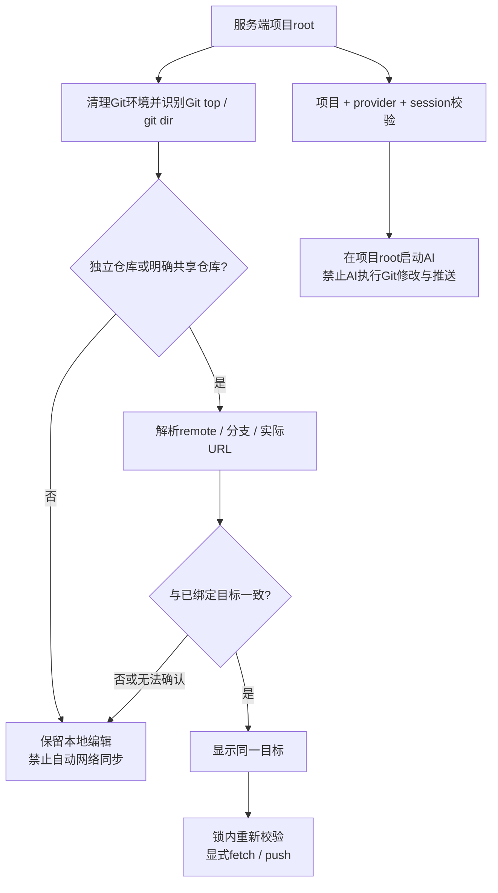

# 论文仓库与工具仓库隔离修复方案

日期：2026-10-08。基础诊断见 [report.md](report.md)，目标差异探针见 [probe.py](probe.py)。

## 目标与证据边界

论文编辑器只能向明确绑定的论文仓库和分支同步。界面显示的目标必须与实际推送目标一致。AI只负责论文编辑，Git同步仍由编辑器执行。

已复现的缺口包括：裸push受pushRemote/pushurl影响；AI继承GIT_DIR后识别错误仓库；无独立Git的论文目录发现父级工具仓库。截图中的具体事件尚未绑定原始任务、项目目录和会话日志，不能先认定为某一个原因。

当前工作区已有其他AI适配改动，包括DeepCode权限设置。实施时保留并复用这些改动，不重新实现、不混入本修复的提交。本文件仅制定方案。

## 统一规则

1. 项目root由服务端决定。客户端和模型不能指定另一个root。
2. 独立仓库及带现有shared marker的共享仓库可同步。普通嵌套仓库不自动同步。
3. 一个编辑器同步目标只有一个remote、一个完整分支ref和一个实际push URL。
4. 推送、拉取、ahead/behind计算和GitHub链接均使用同一个目标。
5. 目标变化时保留本地编辑和提交，暂停网络同步。不得自动改remote、自动重新绑定或要求给工具仓库加权限。
6. Git环境清理是补充隔离。AI的文件、Git写操作及网络权限由后端原生能力执行。



## 第一批：统一同步目标，修复已复现的显示与推送差异

### 修改范围

- `gitsync.py`：一个目标解析函数；复用现有GitSync状态、锁和本地设置文件。
- `server.py`：状态与GitHub链接消费解析结果，不再独立假设origin。
- `static/app.js`：显示仓库、分支和阻止原因；目标变更后清除旧链接缓存。
- `hub.py`：创建/连接论文仓库后记录目标；已有发布路径执行相同校验。
- Git同步测试：覆盖自动保存、Save now、附件同步、回合结束和关闭时flush。

### 目标解析

返回一个简单记录即可，不增加新的Backend或通用策略框架：

```text
remote / branch_ref / fetch_url / push_url / repository_identity
blocked_reason / configuration_fingerprint
```

分支使用完整ref，例如refs/heads/main。通过Git原生查询读取branch配置和已展开的URL，不手写Git配置解析器，也不按字符串切割origin/main来猜remote名称。

候选同步remote取当前分支的明确上游remote；没有上游时仅在origin存在且目标有效时使用origin。没有上游且存在多个不明确候选时暂停同步，不能默认取第一个remote。拒绝detached HEAD、仅指向本地仓库的branch.remote='.'、非法分支ref及无法识别的目标。

查询实际push URL时使用Git的get-url --push --all。它可反映pushurl及Git URL重写。检查branch.pushRemote、remote.pushDefault与已选同步remote是否冲突。检查多个push URL及mirror设置；第一版拒绝这些自动同步模式，保留用户从终端自行处理的能力。

不同传输方式可以指向同一个GitHub仓库，例如HTTPS fetch与SSH push。复用项目已有的GitHub URL识别逻辑进行仓库身份比较。其他主机/本地路径采用明确、保守的比较；不能为了“兼容”而放行未能确认的目标差异。日志和界面不得显示URL中的认证信息。

### 目标绑定及迁移

复用现有git_dir/prism-local.json，增加sync_target，保留sync等既有字段。该文件不提交到论文仓库。

- 编辑器新建论文仓库时，使用刚创建的仓库和分支进行绑定。
- 已有明确绑定的项目直接校验，不增加每回合确认。
- 升级前的旧项目没有绑定记录：先显示解析出的实际目标；首次启用网络同步时，由用户确认一次论文仓库。绑定前仅做本地保存，不自动推送。
- 切换分支或remote导致目标改变：保留旧绑定并暂停同步。用户通过现有GitHub菜单明确更新绑定。
- 移动/重命名目录不应仅因路径字符串变化而丢失绑定。设置按实际git_dir读取；重新验证仓库身份。

第一次绑定不能自动证明仓库就是用户想要的论文仓库。这个信息必须来自已有明确项目配置、仓库创建结果或用户的选择。

### 执行方式

在现有仓库锁内解析并校验目标，再执行显式remote与refspec的push。禁止裸git push；禁止force、mirror、通配分支推送。显式关闭隐式follow-tags，确保一次操作只同步绑定分支。

fetch同样指定目标remote，并使用绑定分支计算ahead/behind及合并。保留现有普通merge和协作历史保护。只增加git push origin仍不够，因为origin.pushurl仍可能指向别处。

外部进程可以修改Git配置，不能声称应用锁使所有Git配置修改都成为原子操作。每次网络操作前重读配置并检查指纹；出现变化立即停止后续操作。验收覆盖推送前配置变化。

### 产品反馈

正常状态显示“同步到owner/paper，分支main”。阻止状态显示“同步目标已改变；本地文件已保存”，并展示预期与实际仓库。这个错误必须区别于权限不足、网络失败和没有remote。

不改变用户remote，不自动清理Git配置，不通过给工具仓库增加权限解决目标差异。

## 第二批：隔离Git环境与项目目录

### 修改范围

`backends.py`、`gitsync.py`、`server.py`、`hub.py`、`registry.py`及DeepCode配置检查。共用一个小型环境过滤函数，分别保留编辑器同步和AI所需的不同权限。

### 规则

删除继承的仓库选择和Git配置注入变量，包括GIT_DIR、GIT_WORK_TREE、GIT_COMMON_DIR、GIT_INDEX_FILE、GIT_OBJECT_DIRECTORY、GIT_ALTERNATE_OBJECT_DIRECTORIES、GIT_CONFIG及动态GIT_CONFIG_COUNT/KEY_*/VALUE_*。

不要清空全部GIT_*变量。编辑器仍需正常的SSH、凭证助手和代理设置；AI继续使用现有transport限制、token清理和原生权限。

清理后重新调用Git原生rev-parse获取实际top和git_dir。支持.git文件形式的worktree；Windows比较复用registry.norm。普通嵌套项目保持自动同步关闭。AI项目读取边界明确使用论文root，不把父级工具仓库当作论文。

DeepCode用户/项目settings.env可以再次注入环境变量。使用现有配置读取实现检查这些仓库选择变量；无法安全抵消时，在启动前报出变量名和配置来源并停止本回合。不要修改用户全局设置，也不要输出key/token值。

复用工作区正在实现的DeepCode权限overlay，验证禁止mutate-git-log、项目外写入和network的实际效果。不得以提示词或GIT_ALLOW_PROTOCOL单独宣称不可绕过。编译MCP仍只接编辑器现有build API。

## 第三批：绑定项目与会话，加入可定位的诊断信息

### 最小会话隔离

复用registry.project_key(root)。服务端在已有info/ping响应中返回project_key和规范root。

前端先取得项目标识，再恢复聊天会话。session、聊天记录和context状态按project_key + provider存储。模型、effort和主题偏好可继续复用现有保存方式。不能只依赖端口区分项目。

服务端核对请求的project_key。浏览器旧页面连接到被复用端口、项目已经变化或绑定不一致时，拒绝启动AI并提示重新打开当前项目。客户端自报标识不是唯一验证依据。

DeepCode恢复前检查session确实位于当前sessions_dir(root)的索引/文件中。禁止从所有项目目录寻找“最近会话”。未知或其他项目的session拒绝恢复；旧记录保留，由用户开始新会话。其他CLI优先复用其原生项目元数据；无法核实的旧会话不盲目迁移。API会话按当前项目标识隔离。

不增加新的会话数据库。只有当前CLI版本确实无法提供项目归属、且现有服务端记录不能解决时，才评估最小本地映射。

### 可定位日志

每次AI启动记录job_id、provider、project_key、cwd和session_id。每次同步记录Git top、目标remote、完整分支ref、脱敏仓库身份、校验结果及失败阶段。

只记录边界信息，不记录论文正文、模型提示、API key或token。现有任务和服务日志入口足够，不增加新的监控服务。

## 验收矩阵

| 场景 | 预期结果 |
| --- | --- |
| 正常独立论文仓库，origin/main | 显示与实际push目标一致；同步成功 |
| 上游remote不是origin | 使用绑定remote，不误回退到origin |
| pushRemote或pushDefault指向工具库 | 校验失败；未发起任何推送 |
| origin fetch为论文，pushurl为工具 | 校验失败；界面指出目标差异 |
| 多个push URL、mirror、URL重写到其他仓库 | 拒绝自动同步；没有第二个目标收到refs |
| 同一GitHub仓库HTTPS/SSH | 身份正确识别，可按已绑定设置同步 |
| 目标绑定后remote或分支改变 | 暂停；本地编辑和提交保留 |
| 论文在普通工具仓库子目录 | 自动同步关闭；不得继承工具项目会话 |
| 明确共享仓库、worktree | 正常支持；只记录本项目变更 |
| 宿主或DeepCode设置注入GIT_DIR | 宿主变量被清理；运行时冲突配置被阻止 |
| 端口复用、旧页面、跨项目session | AI启动前拒绝错误绑定 |
| DeepCode新会话/恢复会话 | cwd及session归属都指向论文；Git修改被拒绝 |
| 自动保存、附件、Save now、关闭flush | 全部经过同一目标校验，无旁路 |
| 并发保存及推送前配置变化 | 不改变目标，不丢本地工作，准确报告阻止原因 |

先用当前探针建立失败回归，固定目标不一致的断言。Git测试用临时bare仓库，不访问真实论文或工具远端。另保留真正的dry-run目标选择检查。

第一批通过后再做后两批。运行相关GitSync、协作、Hub、生命周期和Agent测试；全量测试的既有失败须单独记录。Windows/Linux必须验证DeepCode的真实新会话与恢复会话，不能用macOS夹具替代。

发布前在一个临时论文仓库完成端到端验收，包括实际同步和DeepCode尝试Git修改的拒绝结果。只有目标选择、绑定和权限证据都齐全，才宣布修复完成。

## 交付顺序

1. 目标解析、绑定、显式同步、界面与回归测试。
2. 公共Git环境过滤、目录识别、DeepCode配置冲突检查。
3. 项目会话校验、边界日志、三平台验收和文档更新。

不扩大到附件、Skills目录或模型选择等其他适配功能。原事件日志仍用于定位截图原因，但不阻塞修复已复现的缺口。
